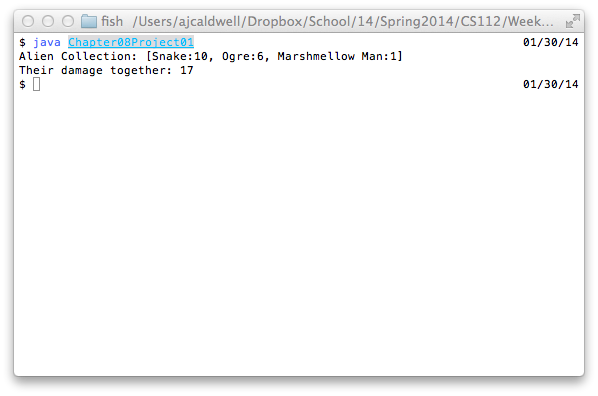

```


/* Chapter No. 8 - Project No.  1.
    File Name:          Chapter08Project01.java
    Programmer:         Andrew Caldwell
    Date Last Modified: Jan. 30, 2013

    Problem Statement:
	Demonstrate subclassing, polyporphism, abstraction and overriding

    Overall Plan
    * alienPack
        * add three alien sublcasses to alienPack
        * display

    Classes needed and Purpose
    main class - Chapter07Project06
    Alien - abstract base class
    AlienPack - Alien manager/collection
    OgreAlien -  subclass of alien 
    SnakeAlien - subclass of alien 
    MarshmellowAlien - subclass of alien  

*/

class Chapter08Project01 {
	public static void main(String[] args) {
		AlienPack _pack = new AlienPack();
		_pack.setAlienAtIndex(new SnakeAlien(),0);
		_pack.setAlienAtIndex(new OgreAlien(),1);
		_pack.setAlienAtIndex(new MarshmellowManAlien(),2);
		System.out.println("Alien Collection: " + _pack);
		System.out.println("Their damage together: " + _pack.calculateDamage());
	}
}

```

---

```


abstract class Alien {
	private String _name; 
	private int _damage;
	private int  _health;
	public static final int MAX_HEALTH = 100;
	public static final int MIN_HEALTH = 0;

	Alien() {
		this("?",MIN_HEALTH);
	}
	Alien(String name, int damage) {
		setName(name);
		setDamage(damage);
		setHealth(MAX_HEALTH);
	}
	Alien(Alien alien) {
		setName(alien.name());
		setDamage(alien.damage());
	}

	// setters
	private void setName(String name) {
		_name = name;
	}
	private void setDamage(int damage) {
		if (damage >= MIN_HEALTH) 
			_damage = damage;
	}
	private void setHealth(int health) {
		if (health >= MIN_HEALTH && health <= MAX_HEALTH)
			_health = health;
	}

	// getters
	public String name() {
		return _name;
	}
	public abstract int damage();
	int health() {
		return _health;
	}
	// utility
	public String toString() {
		return String.format("%s:%d",name(),damage());
	}
}

```

---

```


import java.util.Arrays;

class AlienPack {
	private static final int ALIEN_COUNT = 3;
	private Alien[] _aliens;
	AlienPack() {
		_aliens = new Alien[ALIEN_COUNT];
	}
	AlienPack(Alien[] aliens) {
		setAliens(aliens);
	}

	int calculateDamage() {
		int damage = 0;
		for (Alien alien : _aliens) 
			damage += alien.damage();
		return damage;
	}

	Alien[] aliens() {
		Alien[] aliens = new Alien[ALIEN_COUNT];
		for (int x = 0;x < ALIEN_COUNT;x++) 
			aliens[x] = (Alien) _aliens[x];
		return aliens;
	}

	void setAliens(Alien[] aliens) {
		boolean validArray = true;
		for (Alien alien : aliens) 
			if (alien == null)
				validArray = false;
		if (validArray)
			_aliens = aliens;
	}
	void setAlienAtIndex(Alien alien,int index) {
		if (index >= 0 && index < _aliens.length)
			_aliens[index] = alien;
	}
	public String toString() {
		return Arrays.toString(_aliens);
	}
}

```

---

```


class MarshmellowManAlien extends Alien {
	MarshmellowManAlien() {
		super("Marshmellow Man",1);
	}
	@Override
	public int damage() {
		return 1;
	}
}

```

---

```


class OgreAlien extends Alien {
	OgreAlien() {
		super("Ogre",6);
	}
	@Override 
	public int damage() {
		return 6;
	}
}

```

---

```


class SnakeAlien extends Alien {
	SnakeAlien() {
		super("Snake",10);
	}
	@Override
	public int damage() {
		return 10;
	}
}

```

- - - 


