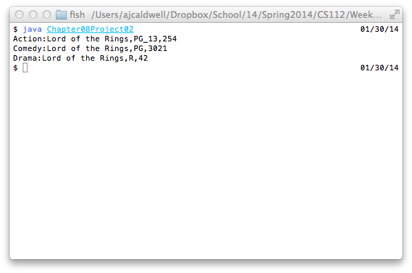

```


/* Chapter No. 08 - Project No. 02
    File Name:          Chapter08Project02.java
    Programmer:         Andrew Caldwell
    Date Last Modified: Jan. 30, 2014
    
    Problem Statement:
		Use polymorphism in a movie model
    
    Overall Plan
		intialize movieArray with three Movie subclasses
		print out movieArray

    Classes needed and Purpose
    main class - Chapter08Project02
    Movie - movie model
	Action - movie model subclass
	Drama - movie model subclass
	Comedy - movie model subclass
	AJTTMoney - money container
*/

class Chapter08Project02 {
	public static void main(String[] args) {
		Movie[] movies = new Movie[3];
		String bestMovieEver = "Lord of the Rings";
		movies[0] = new Action(bestMovieEver,Movie.Rating.PG_13,254);
		movies[1] = new Comedy(bestMovieEver,Movie.Rating.PG,3021);
		movies[2] = new Drama(bestMovieEver,Movie.Rating.R,42);
		for (Movie m : movies)
			System.out.println(m);
	}
}

```

---

```


import java.util.Currency;
import java.math.RoundingMode;
import java.math.BigDecimal;

public class AJTTMoney {
	private static final Currency USD = Currency.getInstance("USD");
    private static final RoundingMode ROUNDING = RoundingMode.HALF_EVEN;
	private BigDecimal _amount; 

	AJTTMoney() {
		setAmount(new BigDecimal(0));
	}
	AJTTMoney(BigDecimal amount) {
		this.setAmount(amount);
	}
	AJTTMoney(AJTTMoney money) {
		this.setAmount(money.amount());
	}

	public void setAmount(BigDecimal amount) {
		_amount = amount.setScale(USD.getDefaultFractionDigits(), ROUNDING);
	}

	public BigDecimal amount() {
		return _amount;
	}

	// Object
	@Override
	public String toString() {
		return String.format("$" + amount());
	}
	@Override
	public boolean equals(Object o) {
		if (o == null)
			return false;
		else if (o.getClass() != this.getClass())
			return false;
		else {
			AJTTMoney otherMoney = (AJTTMoney)o;
			boolean amountIsEqual = otherMoney.amount().equals(this.amount());
			return amountIsEqual;
		}
	}
	@Override
	public int hashCode() {
		return this.amount().hashCode();
	}
}

```

---

```


import java.math.BigDecimal;

class Action extends Movie {
	public static BigDecimal LATE_FEE_MULTIPLIER = new BigDecimal(3.00);
	
	Action(String title, Rating rating, int idNumber) {
		super(title,rating,idNumber);
	}

	@Override
	AJTTMoney calcLateFees(int daysLate) {
		if (daysLate < 0)
			throw new IllegalArgumentException("Days must be positive");
		return new AJTTMoney(LATE_FEE_MULTIPLIER.multiply(new BigDecimal(daysLate)));
	}
}

```

---

```


import java.math.BigDecimal;

class Comedy extends Movie {
	public static BigDecimal LATE_FEE_MULTIPLIER = new BigDecimal(2.50);

	Comedy(String title, Rating rating, int idNumber) {
		super(title,rating,idNumber);
	}
	
	@Override
	AJTTMoney calcLateFees(int daysLate) {
		if (daysLate < 0)
			throw new IllegalArgumentException("Days must be positive");
		return new AJTTMoney(LATE_FEE_MULTIPLIER.multiply(new BigDecimal(daysLate)));
	}
}

```

---

```


import java.math.BigDecimal;

class Drama extends Movie {
	public static BigDecimal LATE_FEE_MULTIPLIER = new BigDecimal(2.00);

	Drama(String title, Rating rating, int idNumber) {
		super(title,rating,idNumber);
	}

	@Override
	AJTTMoney calcLateFees(int daysLate) {
		if (daysLate < 0)
			throw new IllegalArgumentException("Days must be positive");
		return new AJTTMoney(LATE_FEE_MULTIPLIER.multiply(new BigDecimal(daysLate)));
	}
}

```

---

```


import java.math.BigDecimal;

class Movie {
	public static enum Rating {
		G,PG,PG_13,R;
	}
	public static BigDecimal LATE_FEE_MULTIPLIER = new BigDecimal(2.00);

	private Rating _rating;
	private int _idNumber;
	private String _title;

	Movie() {
		this(null,null,0);
	}
	Movie(String title, Rating rating, int idNumber) {	
		setRating(rating);
		setIdNumber(idNumber);
		setTitle(title);
	}

	AJTTMoney calcLateFees(int daysLate) {
		if (daysLate < 0)
			throw new IllegalArgumentException("Days must be positive");
		return new AJTTMoney(LATE_FEE_MULTIPLIER.multiply(new BigDecimal(daysLate)));
	}

	// getters
	public Rating rating() {
		return _rating;
	}
	public int idNumber() {
		return _idNumber;
	}
	public String title() {
		return _title;
	}

	// setters
	public void setIdNumber(int idNumber) {
		if (idNumber < 0) 
			throw new IllegalArgumentException("ID must be positive");
		_idNumber = idNumber;
	}
	public void setRating(Rating rating) {
		_rating = rating;
	}
	public void setTitle(String title) {
		_title = title;
	}

	// Object
	@Override
	public boolean equals(Object o) {
		if (o == null)
			return false;
		else if (this.getClass() != o.getClass())
			return false;
		else {
			Movie otherMovie = (Movie)o;
			boolean idNumberIsEqual = this.idNumber() == otherMovie.idNumber();
			return idNumberIsEqual;
		}
	}

	@Override
	public int hashCode() {
		return this.rating().ordinal() ^ this.idNumber() ^ this.title().hashCode();
	}
	@Override
	public String toString() {
		return this.getClass().getName() + ":" + this.title() + "," + this.rating() + "," + this.idNumber();
	}
}

```

- - -


