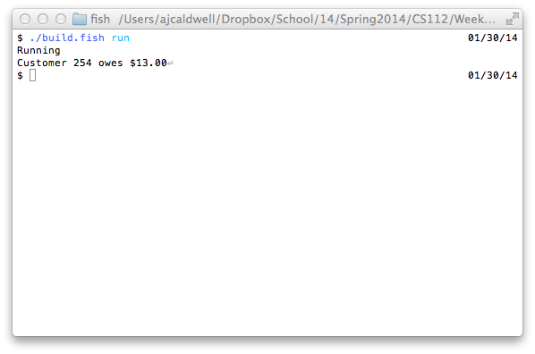

```


/* Chapter No. 08 - Project No. 03
    File Name:          Chapter08Project03.java
    Programmer:         Andrew Caldwell
    Date Last Modified: Jan. 30, 2014
    
    Problem Statement:
		Use polymorphism in a program
    
    Overall Plan
		intialize rentalArray with movieArray
		calculate and print out the total rental fees

    Classes needed and Purpose
    main class - Chapter08Project03
    Rental - rental movie model
    Movie - movie model
	Action - movie model subclass
	Drama - movie model subclass
	Comedy - movie model subclass
	AJTTMoney - money container
	BigDecimal - good precision
	System - streams
	String - arrays of chars

*/

import java.math.BigDecimal;

public class Chapter08Project03 {
	public static int CUS_ID = 254;
	public static void main(String[] args) {
		Movie[] lotr = {new Action("The Fellowship of the Ring", Movie.Rating.G,2)
		, new Comedy("The Two Towers", Movie.Rating.PG,5)
		, new Drama("The Return of the King", Movie.Rating.PG_13,4)};
		
		Rental[] rentals = new Rental[3];
		
		for (int i = 0;i < rentals.length;i++)
			rentals[i] = new Rental(CUS_ID,lotr[i],2*i);
		System.out.format("Customer %d owes %s",CUS_ID,lateFeesOwed(rentals));

	}
	public static AJTTMoney lateFeesOwed(Rental[] rentals) {
		BigDecimal lateFeesOwed = new BigDecimal(0);

		for (Rental r : rentals) {
			lateFeesOwed = lateFeesOwed.add(r.lateFees().amount());
		}

		return new AJTTMoney(lateFeesOwed);
	}
}

```

---

```


import java.math.BigDecimal;

public class Rental {
	private int _daysLate;
	private Movie _movie;
	private int _idNumber;

	Rental() {
		this(0,null,0);
	}
	Rental(int idNumber, Movie movie, int daysLate) {
		setIdNumber(idNumber);
		setMovie(movie);
		setDaysLate(daysLate);
	}

	// ?
	public AJTTMoney lateFees() {
		return this.movie().calcLateFees(this.daysLate());
	}

	// setters
	public void setIdNumber(int idNumber) {
		if (idNumber < 0)
			throw new IllegalArgumentException("ID number must be greater than zero.");
		_idNumber = idNumber;
	}
	public void setMovie(Movie movie) {
		_movie = movie;
	}
	public void setDaysLate(int daysLate) {
		if (daysLate < 0)
			throw new IllegalArgumentException("Number of days late be greater than zero.");
		_daysLate = daysLate;
	}

	// getters
	public int idNumber() {
		return _idNumber;
	}
	public Movie movie() {
		return _movie;
	}
	public int daysLate() {
		return _daysLate;
	}

	// Object 
	@Override
	public String toString() {
		return this.getClass().getName() + ":" + idNumber() + ",<" + movie() + ">," + daysLate();
	}
}

```

- - - 


