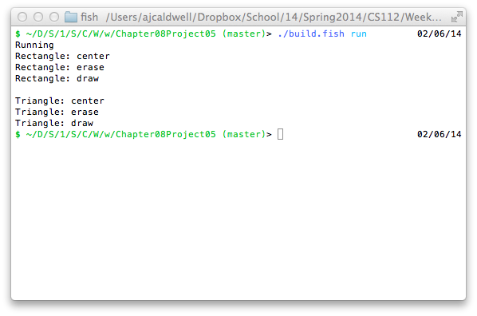

```
/* Chapter No. 08 - Project No. 05
    File Name:          Chapter08Project05.java
    Programmer:         Andrew Caldwell
    Date Last Modified: Feb. 6, 2014
    
    Problem Statement:
		Stub out methods for Project 8.6
    
    Overall Plan
	# Create base class
	* use reflection to write code for me

    Classes needed and Purpose
    main class - Chapter08Project05
    Figure - Abstract base class 
    Rectangle - Figure subclass
    Triangle - Figure subclass
*/


public class Chapter08Project05 {
	public static void main(String[] args) {
		Figure r = new Rectangle();
		Figure t = new Triangle();
		r.center();
		System.out.println();
		t.center();
	}
}

```
---
```

public abstract class Figure {
	void erase() {
		printClassAndCallingMethod();
	}
	void draw() {
		printClassAndCallingMethod();
	}
	void center() {
		printClassAndCallingMethod();
		erase();
		draw();
	}
	public void printClassAndCallingMethod() {
		Exception e = new Exception();
		e.fillInStackTrace();
		System.out.println(getClass().getName() + ": " + e.getStackTrace()[1].getMethodName());
	}
}

```
---
```

public class Rectangle extends Figure {
}

```
---
```

public class Triangle extends Figure {
}
```


