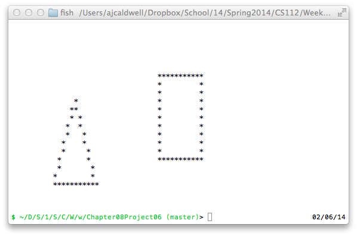

```
/* Chapter No. 08 - Project No. 06
    File Name:          Chapter08Project06.java
    Programmer:         Andrew Caldwell
    Date Last Modified: Feb. 6, 2014

    Problem Statement:
		Implement classes from 8.5

    Overall Plan
    * make a coordinate system that can hold the figures.
    * find an algorithm used to draw pixels
    * use algorithm in Screen class
    * just use the figures for holding their points

    Classes needed and Purpose
    main class - Chapter08Project06
    Figure - Abstract base class
    Rectangle - Figure subclass
    Triangle - Figure subclass
    Screen - grid
	Point - X,Y
	Frame - bounds and origin
*/


import java.io.*;

public class Chapter08Project06 {
	public static Frame DEFAULT_FRAME = new Frame(10,10,new Point(10,10));
	AJTTDrawing d;

	public static void main(String[] args) {
		Screen s = new Screen(getTerminalFrame());
		Figure r = new Rectangle(s,DEFAULT_FRAME);
		Figure t = new Triangle(s,DEFAULT_FRAME);

		r.draw();
		r.center();
		t.draw();

		s.print();
	}

	public static Frame getTerminalFrame() {
		Frame terminalFrame = new Frame();

		BufferedReader input;
		Process process;
	    String line;

	    try {
	    	// get height
	    	String[] tputLines = {"/bin/bash","-c","tput lines"};
			process = Runtime.getRuntime().exec(tputLines);
		    input = new BufferedReader(new InputStreamReader(process.getInputStream()));
		    
		    if ((line = input.readLine()) != null) {
		    	terminalFrame.setHeight(Integer.parseInt(line));
		    } else {
		    	throw new IOException();
		    }
		    input.close();

		    // get width
		    String[] tputCols = {"/bin/bash","-c","tput cols"};
		    process = Runtime.getRuntime().exec(tputCols);
		    input = new BufferedReader(new InputStreamReader(process.getInputStream()));
		    
		    if ((line = input.readLine()) != null) {
		    	terminalFrame.setWidth(Integer.parseInt(line));
		    } else {
		    	throw new IOException();
		    }
		    input.close();

		} catch (IOException e) {
			// 80,25
			terminalFrame.setWidth(80);
			terminalFrame.setHeight(25);
		}

		return terminalFrame;
	}
}

```
---
```

public abstract class Figure {
	private Screen _screen;
	private Frame _frame;
	void draw() {
		printClassAndCallingMethod();
	}
	void erase() {
		printClassAndCallingMethod();
	}
	void center() {
		erase();

		Point center = new Point(getScreen().getFrame().getWidth()/2,getScreen().getFrame().getHeight()/2);
		int xOffset = getFrame().getWidth()/2;
		int yOffset = getFrame().getHeight()/2;
		Point offsetOrigin = new Point(center.getX() - xOffset, center.getY() - yOffset);
		Frame centeredFrame = new Frame(getFrame().getWidth(),getFrame().getHeight(),offsetOrigin);
		setFrame(centeredFrame);

		draw();
	}
	public void printClassAndCallingMethod() {
		Exception e = new Exception();
		e.fillInStackTrace();
		System.out.println(getClass().getName() + ": " + e.getStackTrace()[1].getMethodName());
	}

	// 
	public Point[] getCorners() {
		Point[] array = {upperLeft(),upperRight(),lowerRight(),lowerLeft()};
		return array;
	}
	public Point upperLeft() {
		return getFrame().getOrigin();	
	}
	public Point upperRight() {
		return new Point(getFrame().getOrigin().getX() + getFrame().getWidth(), getFrame().getOrigin().getY());	
	}
	public Point lowerLeft() {
		return new Point(getFrame().getOrigin().getX(), getFrame().getOrigin().getY() + getFrame().getHeight());	
	}
	public Point lowerRight() {
		return new Point(upperRight().getX(),lowerLeft().getY());	
	}
	

	// boiler
	public void setFrame(Frame frame) {
		_frame = frame;
	}
	public Frame getFrame() {
		return _frame;
	}
	public void setScreen(Screen screen) {
		_screen = screen;
	}
	public Screen getScreen() {
		return _screen;
	}

}

```
---
```

public class Frame {
	private int _width;
	private int _height;
	private Point _origin;
	
	Frame() {
		this(0,0);
	}
	Frame(int width, int height) {
		this(width,height,new Point(0,0));
	}
	Frame(int width, int height, Point origin) {
		setWidth(width);
		setHeight(height);
		setOrigin(origin);
	}
	Frame(Frame frame) {
		setWidth(frame.getWidth());
		setHeight(frame.getHeight());
		setOrigin(frame.getOrigin());
	}

	public boolean inBounds(Point point) {
		boolean xInBounds = (point.getX() < getOrigin().getX() + getWidth());
		boolean yInBounds = (point.getY() < getOrigin().getY() + getHeight());
		return xInBounds && yInBounds;
	}

	// Boiler
	public int getWidth() {
		return _width;
	}
	public int getHeight() {
		return _height;
	}
	public Point getOrigin() {
		return _origin.copy();
	}
	public void setWidth(int width) {
		if (width < 0)
			throw new IllegalArgumentException("Negative " + width + "width.");
		_width = width;
	}
	public void setHeight(int height) {
		if (height < 0)
			throw new IllegalArgumentException("Negative " + height + "height.");
		_height = height;
	}
	public void setOrigin(Point origin) {
		_origin = origin;
	}
	public Frame copy() {
		return new Frame(getWidth(),getHeight(),getOrigin());
	}
	@Override
	public String toString() {
		return "<" + getWidth() + "," + getHeight() + "," + getOrigin() + ">";
	}

}

```
---
```

public class Point {
	int _x;
	int _y;
	Point(Point point) {
		this(point.getX(), point.getY());
	}
	Point(int x, int y) {
		setX(x);
		setY(y);
	}

	// getters
	public int getX() {
		return _x;
	}
	public int getY() {
		return _y;
	}

	// setters
	public void setX(int x) {
		if (x < 0)
			throw new IllegalArgumentException("Negative " + x + " x.");
		_x = x;
	}
	public void setY(int y) {
		if (y < 0)
			throw new IllegalArgumentException("Negative " + y + " y.");
		_y = y;
	}
	// Object
	@Override
	public String toString() {
		return "(" + this.getX() + "," + this.getY() + ")";
	}

	@Override
	public boolean equals(Object o) {
		if (o == null) {
			return false;
		}
		else if (o.getClass() != this.getClass()) {
			return false;
		}
		else  {
			Point p = (Point)o;
			boolean xIsEqual = this.getX() == p.getX();
			boolean yIsEqual = this.getY() == p.getY();
			return xIsEqual && yIsEqual;
		}
	}
	public Point copy() {
		return new Point(this);
	}
}

```
---
```

public class Rectangle extends Figure {
	Rectangle(Screen screen,Frame frame) {
		setScreen(screen);
		setFrame(frame);
	}
	@Override
	void draw() {
		// Naaaaaants ingonyama bagithi Baba!
		// Sithi uhm ingonyama!
		// It's the Cirrrrcle of Life!
		getScreen().addLine(upperLeft(),upperRight());
		getScreen().addLine(upperRight(),lowerRight());
		getScreen().addLine(lowerRight(),lowerLeft());
		getScreen().addLine(lowerLeft(),upperLeft());
	}
	@Override
	void erase() {
		getScreen().removeLine(upperLeft(),upperRight());
		getScreen().removeLine(upperRight(),lowerRight());
		getScreen().removeLine(lowerRight(),lowerLeft());
		getScreen().removeLine(lowerLeft(),upperLeft());
	}
}

```
---
```

import java.util.Arrays;
public class Screen {
	private boolean[][] _grid; 
	private Frame _frame;

	Screen(Frame frame) {
		setFrame(frame);
	}
	
	private void plot(int x,int y) {
		_grid[x][y] = true;
	}
	private void free(int x,int y) {
		_grid[x][y] = false;
	}
	public void print() {
		for (int y = 0;y < getFrame().getHeight();y++) { 
			for (int x = 0;x < getFrame().getWidth();x++) {
				boolean isFilled = _grid[x][y];
				String s = (isFilled)?"*":" ";
				System.out.print(s);
			}
			System.out.println();
		}
	}
	public void addLine(Point pointA, Point pointB) {
		if (!(getFrame().inBounds(pointA) || getFrame().inBounds(pointB))) {
			throw new IllegalArgumentException("Line out of bounds");
		}

		int x0 = pointA.getX();
		int y0 = pointA.getY();
		int x1 = pointB.getX();
		int y1 = pointB.getY();

		// Bresenham's line algorithm
		int deltaX = Math.abs(x0 - x1);
		int deltaY = Math.abs(y0 - y1);
		int stepX = x0<x1 ? 1 : -1;
		int stepY = y0<y1 ? 1 : -1;
		int error = ((deltaX>deltaY)?deltaX:-deltaY)/2; 
		int deltaError;

		for (;;) {
			plot(x0,y0);
			if (x0 == x1 && y0 == y1) 
				break;
			deltaError = error;
			if (deltaError > -deltaX) {
				error -= deltaY;
				x0 += stepX;
			}
			if (deltaError < deltaY) {
				error += deltaX;
				y0 += stepY;
			}
		}
	}
	public void removeLine(Point pointA, Point pointB) {
		if (!(getFrame().inBounds(pointA) || getFrame().inBounds(pointB))) {
			throw new IllegalArgumentException("Line out of bounds");
		}

		int x0 = pointA.getX();
		int y0 = pointA.getY();
		int x1 = pointB.getX();
		int y1 = pointB.getY();

		// Bresenham's line algorithm
		int deltaX = Math.abs(x0 - x1);
		int deltaY = Math.abs(y0 - y1);
		int stepX = x0<x1 ? 1 : -1;
		int stepY = y0<y1 ? 1 : -1;
		int error = ((deltaX>deltaY)?deltaX:-deltaY)/2; 
		int deltaError;

		for (;;) {
			free(x0,y0);
			if (x0 == x1 && y0 == y1) 
				break;
			deltaError = error;
			if (deltaError > -deltaX) {
				error -= deltaY;
				x0 += stepX;
			}
			if (deltaError < deltaY) {
				error += deltaX;
				y0 += stepY;
			}
		}
	}
	// boiler
	public boolean[][] getGrid() {
		boolean[][] publicGrid = new boolean[_grid.length][_grid[0].length];
		for (int x = 0;x < _grid.length; x++) {
			for (int y = 0;y < _grid[0].length; y++) { 
				publicGrid[x][y] = _grid[x][y];
			}
		}

		return publicGrid;
	}
	public Frame getFrame() {
		return _frame;
	}
	public void setFrame(Frame frame) {
		_frame = frame;
		if (_grid != null) {
			boolean[][] newGrid = new boolean[frame.getWidth()][frame.getHeight()];
			for (int x = 0;x < newGrid.length;x++) {
				for (int y = 0;y < newGrid[x].length;y++) {
					newGrid[x][y] = _grid[x][y];
				}
			}
			_grid = newGrid;
		} else {
			_grid = new boolean[frame.getWidth()][frame.getHeight()];
		}
	}

}

```
---
```

public class Triangle extends Figure {
	Triangle(Screen screen) {
		this(screen,new Frame());
	}
	Triangle(Screen screen, Frame frame) {
		setScreen(screen);
		setFrame(frame);
	}
	@Override 
	void draw() {
		// Naaaaaants ingonyama bagithi Baba!
		// Sithi uhm ingonyama!
		// It's the Cirrrrcle of Life!
		
		getScreen().addLine(upperMiddle(),lowerRight());
		getScreen().addLine(lowerRight(),lowerLeft());
		getScreen().addLine(lowerLeft(),upperMiddle());
	}

	@Override
	void erase() {
		getScreen().removeLine(upperMiddle(),lowerRight());
		getScreen().removeLine(lowerRight(),lowerLeft());
		getScreen().removeLine(lowerLeft(),upperMiddle());
	}

	public Point upperMiddle() {
		return new Point(getFrame().getOrigin().getX() + getFrame().getWidth()/2, getFrame().getOrigin().getY());
	}
}
```


